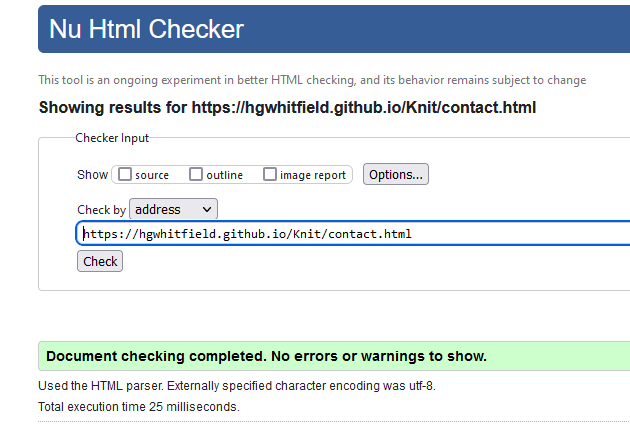

# Knit And Natter With Jan

:computer: View the live site **[here](https://hgwhitfield.github.io/Knit/)**

Knit and Natter with Jan is a website designed as the virtual counterpart of Jan's beloved knitting shop, embodying the same warmth and welcoming atmosphere that the physical store is known for. The platform serves as a resource of information for those who wish to know more about the business, offering detailed information about the shop, its offerings, and the vibrant community that gathers there. While the website aims to project a professional and reliable image to instill confidence in potential visitors, it also captures the social and cozy essence that Jan's shop is celebrated for. With a focus on accessibility, the site is crafted to ensure ease of navigation, catering to the diverse age range of the knitting community, from older seasoned enthusiasts to the burgeoning number of younger hobbyists. The goal is to blend functionality with aesthetic appeal, making it a welcoming online space for all knitting aficionados.

1. [Purpose of the Project](#purpose-of-the-project)
2. [User Stories](#user-stories)
3. [Strategy](#strategy)
4. [Features](#features)
5. [Future Features](#future-features)
6. [Typography and Color Scheme](#typography-and-color-scheme)
7. [Wireframes](#wireframes)
8. [Technology](#technology)
9. [Testing](#testing)
   - [Code Validation](#code-validation)
   - [Test Cases](#test-cases)
   - [Fixed Bugs](#fixed-bugs)
   - [Supported Screens and Browsers](#supported-screens-and-browsers)
10. [Deployment](#deployment)
    - [Via Gitpod](#via-gitpod)
    - [Via GitHub Pages](#via-github-pages)
11. [Credits](#credits)

## Purpose of the Project

"Knit and Natter with Jan" is a charming, user-friendly website dedicated to Jan's knitting club and shop, a cozy nook for knitting enthusiasts and newcomers alike. This digital space serves as a welcoming introduction to the community and physical store, offering visitors a glimpse into the world of knitting through Jan's eyes. The website is designed to be straightforward and accessible, ensuring that users of all ages and tech-savviness can easily navigate through the content.

The site is structured around key sections that provide essential information to visitors. These include About pages for both the shop and the club, where information about what services we provide are shared, capturing the warmth and community spirit that Jan fosters. The website is an invite to the local community members and visitors to join in and knit together.

The Contact Us page is a crucial touchpoint, offering visitors various ways to reach out, ask questions, and get involved. Whether it's through an email, or a visit to the shop, this section ensures that the community is just a message away.

"Knit and Natter with Jan" aims to extend the warmth and camaraderie of Jan's knitting club and shop into the online realm, inviting knitters and crafters to explore, connect, and create, no matter where they are.

## User Stories
I have laid out my user stories as follows:
As a [type of user], I want [an action] so that [a reason/a value]

**First Time Visitor Goals**
1. As a first-time visitor, I want to quickly understand the purpose of the site from the index page so that I can determine if this is a website that I want to use.
2. As a first-time visitor, I want to easily navigate throughout the website so that I can find the information I am looking for without difficulty.
3. As a first-time visitor, I want to be able to easily contact the shop/club so that I can address any questions that I may have.
4. As a first-time visitor, I want reassurances from the site that I will be welcomed at the club so that I feel at ease before visiting.
5. As a first-time visitor, I want the site to convey a sense of professionalism and capability so that I feel assured the business can provide the service I am seeking.

## Strategy

#### Project Goals
The primary aim of "Knit and Natter with Jan" is to develop an engaging, static front-end website using HTML5 and CSS3 that effectively communicates the essence of a community-based knitting club and shop. The site aims to present information in a visually appealing manner, ensuring an intuitive user experience that aligns with the interests and goals of its visitors.

#### Business Goals

The website's core mission is to enhance the visibility of "Knit and Natter with Jan," ultimately driving membership growth and fostering a loyal community. By presenting a well-designed, informative site, the aim is to convey the value and warmth of the knitting club, encouraging visitors to engage further by visiting the shop or joining the club. It also intends to alleviate anxiety new members of the club may have about turning up to their first club meeting.

Target Audience: "Knit and Natter with Jan" is geared towards knitting enthusiasts of all skill levels, particularly those within the local area and beyond who seek a supportive community. The target demographic includes individuals who appreciate the therapeutic and social aspects of knitting, ranging from young adults to seniors.

#### Customer Goals

Prospective members and first-time site visitors: The site aims to introduce visitors to the welcoming and inclusive atmosphere of Jan's knitting club, highlight the benefits of joining the community, provide information on the services that the business provides and encourage them to become a part of the vibrant knitting circle.

For the future, there are plans for the site to include a section for members to get and share knitting patterns, instructional videos, and be able to engage on days we aren't open so that the business can further engage the community and enhance the experience. Future updates will provide business specific pictures and a place to display some of the work completed by members of the club, to make the website a more personable experience.

## Features

Here is a list of the features that are currently implemented on the website as well as plans for future features:

### Current Features:

### Navbar

- The navbar prominently displays the "Knit and Natter with Jan" logo, which serves as a welcoming emblem for your community of knitting enthusiasts.
- Clicking on the logo conveniently brings users back to the homepage, ensuring easy navigation and a home base for visitors to return. It is also has a fun hover effect to provide tactile feedback and improve the overall feel of the site.
- The navbar includes easy to understand menu options for different sections of the site, such as "Shop" "Club" and "Get in touch!"
- The entire navbar is responsive, adapting to different screen sizes. On larger desktop screens it is a complete navbar with all sections are visible to be clicked on straight away. On mobiles and ipads it utilises a hamburger symbol and the menu utilises the 'offcanvas' effect to intuitvely appear from the side of the screen.

### Hero Image

- On opening the home page there is a hero image at the top of the screen. This fun design is to add a welcoming tone to the site and its tagline 'unwind with us'. Is both a fun pun and a call to action for the customer to visit while maintaining the chilled out 'vibe' that jan maintains in her business.
- The image is in fitting with the design of the page both in colour (of the wool pictured and the tagline) and in font though this has been styled by the designer.
- The image scales to different sizes depending on the screen size. This allows the entire image to always be visible.
- Similar images are used on other pages to add a sense of continuity across the site.

### Index Navigation Cards

- The navigation cards on the index page provide a concise and intuitive introduction to the various services offered by the business. They present information in an easily digestible manner, enabling users to quickly identify and navigate to the sections of interest for further exploration. This dual-purpose design efficiently fulfills both informational and navigational needs.
- They are stylised and animated on hover, this gives the user a robust tactile sense that they are clickable elements.
- They are adapatable to all screen sizes appearing as a row in larger screen sizes and in a column in smaller ones.
- Every card has an image attached, the image is relevant in some way to the page it links to at least thematically and allows for some visual story telling to provoke an emotional response from the user.

### Review Carousel

- The Review carousel was implented as a way to show off the good reviews of the business and to help create a feeling of security in the brand and a desire to get involved.
- It allows an interactive way for the the user to see several of the good reviews the business has recieved but in a way that doesn't take up too much screen real estate and clutter the site. Users who want to read multiple reviews can work across the carousel and read them and user who don't desire don't have to scroll through reams of text to get to the information in the footer.
- The carousel adapts to different screen sizes. In larger screen sizes (desktop, tablet) it is a visual feature. On smaller screen sizes it disappears altogether as to not clutter the site and keep it snappy. The carousel notably became unsightly under a certain size so it is removed to better suit the mobile styling.

### Footer

- The footer contains key information that users want to know and provides it in an easily accessible place that is consistent and the same across all pages.
- Opening hours are displayed in full along side the address and contact details of the business. 
- It is easy to read and clear.

### Brands We Stock Section

- The brands we stock section is an easy way to present customers with an idea of the sort of stock they are going to find inside of the shop.
- It's visual and easy to understand for anyone. 
- The logo's will be familiar to seasoned propsective customers, but even if not it's visual aspect doesn't hinder new knitters.

### Reasons to Join Section

- This uses bootstraps card system to provide 3 reasons to join the club in a visually pleasing and easy to read way.
- The font awesome icons give the information a visual aspect and help style the page.
- They adapt to different screen sizes in terms of layout.

### How to Find Us

- The 'How to Find Us' section includes a google maps intergration to give an easy visual cue to our location and an easy way to link out for direction.
- The address is provided in writing aswell, this is incase any issues arise with the google maps intergration.
- It is stylistically pleasing and easy for users to understand.

### Contact Form

- The contact form provides users with an easy way to contact the business quickly, directly from the webite. 
- It is simple and easy to understand. 
- The form asks for things the users are used to and is layed out in a similar fashion to other contact forms to lend an air of familiarity. 

## Future Features 

- First planned changes are in the content of the site. Better more bespoke images will replace or be added alongside stock images to create a more personable feel.
- A members log in with a place to share knitting patterns.
- A social media intergration or area for the business to self upload images of new things created by the club.
- In the medium to longer term, we envision incorporating an e-commerce aspect to the site.

## Typography and color scheme

### Colors:

### Body: 

#FFFFFF is used on the body to give a clean base for styling.

### Logo, Icons, Buttons, Font-Awesome Icons and Miscellaneous Items:

#F499C1 This pink colour originates from the logo of the business. I have used it throughtout to give the business branding continuity.

### Bootstrap Container Icons:

#f499c054 This is a more transparent and paler change to the pink branding colour. It is moslty used as a background to text in bootstrap containers. It allows for continuity without over filling the page with the harsher logo pink and make it easier for users to read text.

### Text:

#333 black choosen to be easy to read over background colours and for its simple timeless nature.

## Fonts:

- The main font used in the website is 'Fira Sans' This was choosen for two reasons the main one it is legible and easy to read, but it is also the font from the 'knit and natter' section of the logo. This allows for the company branding to flow through the website.

- 'Caveat' is the other font used in the logo and this is used to style the 'with Jan' in the h1 on the index page. Also used for branding continuity. 

## Wireframes

#### Index Wireframes:

#### Shop Wireframes: 

#### Club Wireframes:

#### Contact Wireframes: 

## Technology

1. HTML: To create the structure and the content of the website

2. CSS: To create the style for the website and its content

3. [Git:](https://git-scm.com/) Used for version control.

4. [Gitpod:](https://www.gitpod.io/) Was used as the coding enviorment. 

5. [Github:](https://github.com/) To store, host and deploy the website

6. [Balsamiq:](https://balsamiq.com/) To create the wireframes for the design process.

7. [Bootstrap:](https://getbootstrap.com/) Utilised for the grid system and some of the 'card' features.

8. [Google Fonts:](https://fonts.google.com/) For the fonts on the site.

9. [Font Awesome:](https://fontawesome.com/) For the icons on the site.

10. [ChatGPT:](https://chat.openai.com/) Utilised for troubleshooting code and as a starting off point for text content.

## Testing

### Code Validation

### Lighthouse

### Test Cases

#### User Story Test Case: I want to be able to easily contact the shop/club, in order to address any questions that I may have.

- On entering the website homepage I scroll down and see the 'Contact' and 'Get In touch' 

- After seeing this large easy to understand element I click on it and I'm lead to the 'Contact' page.

- Apart from the Navbar the first thing on the page is the Contact Form. Unfamiliar users may try to submit without filling out details. So the required element is in all fields to give them help and to make sure we don't receieve bad data.

- I may forget to fill out a segment, the website will prompt me to fill it out helping me avoid any confusion.

- Once all areas are filled out the submit button will then have an effect and send my message.

- I am then taken to the codeinstitute formdump page and my message is sent. I can then wait for a reply to my email address.

#### User Story Test Case: I want to be able to easily navigate throughout the website in order to find out the information that I want.

- From the index page if I want to navigate I have two options. 

- If I scroll down the page I come to the navigation card section. These are large cards that are fully clickable that give a summary of the different website pages and will navigate you there.

- On clicking anywhere on the card I am taken to my preffered part of the site and already have been given an indication of what I will find there beyond the title.

- Alternatively, on entering the website I see the navbar. On mobile and tablet I see the easily recongised and well known 'hamburger icon'. I know from experiece this will provide me with a menu.

- On clicking the icon I get an offcanvas menu giving me a list of easy to understand menu options I can quickly and easily navigate too.

User stories were tested on mobile as from research it is the more popular way to view websites now.

### Fixed Bugs

- When testing my website with my mentor we discovered that in smaller mobile screen sizes the padding for the text was off making the website unreadable. I implented a media query and changed a padding setting from a pixel amount to a percentage and this fixed the issue.

- My 'offcanvas menu' wasn't appearing correctly on some mobile screens initially. I made some changes with a media query and got this to work correctly.

### Supported Screens and Browsers

The website underwent extensive testing on a diverse array of devices to ensure optimal responsiveness and compatibility, utilizing Google Developer Tools for precise emulation. The testing covered a wide spectrum of devices, including various models from leading brands and specific devices known for unique screen sizes or operating systems. Here's a condensed list, categorized by brand and device type for clarity:

#### Samsung Galaxy Series:

- Galaxy S3, S8, S9 Plus S20 Ultra 
- Note 2, Note 3 
- A51
- Galaxy Tab S4
- Galaxy Fold

#### Apple Devices:

- iPhones: iPhone 4, SE (1st gen), 6, 7, 8, X, XR, 12 Pro, 14 pro max
- iPads: iPad,, iPad Air, iPad Pro

#### Google Devices:

- Pixel 3, 3 XL, 4, 5
- Nexus 7, 10

#### Nexus Phones:

- Nexus 4, 5, 5X, 6, 6P

#### Blackberry Devices:

- Blackberry Z30
- Blackberry PlayBook

#### Amazon Devices:

- Kindle Fire HDX

#### LG Phones:

- LG Optimus L70

#### Microsoft Devices:

- Surface Pro 7
- Surface Duo

#### Motorola Phones:

- Moto G4

#### Nokia Phones:

- Lumia 520
- N9

#### Smart Displays:

- Nest Hub
- Nest Hub Max

## Deployment

#### Via Gitpod

The project was successfully deployed using Gitpod. Here's how you can deploy your project on Gitpod:

- Navigate to GitHub and find the repository you want to deploy using Gitpod.
- Click on the "Gitpod" button, which you can find on the top right section of your repository page.
- This action will initiate a new workspace in Gitpod for the project.
- Within the Gitpod workspace, open the Terminal and execute the command python3 -m http.server.
- Shortly after, a blue notification will appear at the bottom right corner, offering options to either make the server public, preview it, or open it in a browser.

#### Via GitHub Pages

The project was also deployed on GitHub Pages. To deploy your project on GitHub Pages, follow these steps:

- Sign into your GitHub account and select the repository intended for deployment to GitHub Pages.
- Navigate to the repository's "Settings" by clicking the button located on the top right corner of the repository section.
- On the Settings page, scroll down until you find the "GitHub Pages" section in the left-hand menu.
- In the "Source" section, click on the dropdown menu labeled "Branch" and change it from "None" to "Master".
- The website will refresh automatically, and the deployment link will be displayed at the top of the GitHub Pages section.

## Credits

- Bootstrap version 5's comprehensive examples and documentation. This provided the basis for the idea for the card sections on the Index and Club pages. I also used the example code for the carousel as a starting off point for my review carousel.
- I took inspiration from the Whiskey project for hero image at the top of the page even though stylistically different it was a jumping off point.
- CHATGPT for help in trouble shooting some code issues I had when trying to size my containers, and for helping me get started with some of the larger pieces of text on the site.
- Pexels and Unsplash for providing the stock images.
- Cassie by Designs a local graphic designer for creating the hero image and the Logo svg for the site.
- Rohit Sharma my mentor for his generous giving of time for feedback and help planning. 